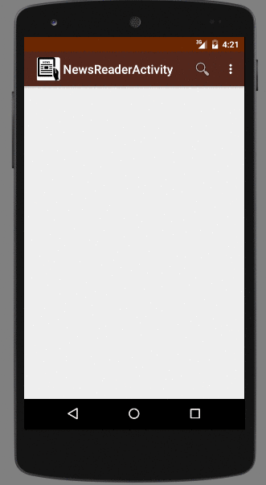

# Assigment#2 - *android-news-reader*

*News Reader  is an android app that allows a user to search for images on web using simple filters. The app utilizes [New York Times Search API](http://developer.nytimes.com/docs/read/article_search_api_v2).
 
 Time spent: 15 hours spent in total
 
 ## User Stories
 
 The following **required** functionality is completed:
 
* [x] User can **search for news article** by specifying a query and launching a search. Search displays a grid of image results from the New York Times Search API.
* [x] User can click on "settings" which allows selection of **advanced search options** to filter results
* [x] User can configure advanced search filters such as:
  * [x] Begin Date (using a date picker)
  * [x] News desk values (Arts, Fashion & Style, Sports)
  * [x] Sort order (oldest or newest)
* [x] Subsequent searches have any filters applied to the search results
* [x] User can tap on any image in results to see the full text of article **full-screen**
* [x] User can **scroll down to see more articles**. The maximum number of articles is limited by the API search.
 
 

 
## Video Walkthrough

Here's a walkthrough of implemented user stories:

## Notes

Describe any challenges encountered while building the app.

1. Butterknife was not binding the values.
2. Grid view layout was always gving sack overflow error on getting results.

## Open-source libraries used

- [Android Async HTTP](https://github.com/loopj/android-async-http) - Simple asynchronous HTTP requests with JSON parsing
- [Picasso](http://square.github.io/picasso/) - Image loading and caching library for Android

## License

    Copyright [yyyy] [name of copyright owner]

    Licensed under the Apache License, Version 2.0 (the "License");
    you may not use this file except in compliance with the License.
    You may obtain a copy of the License at

        http://www.apache.org/licenses/LICENSE-2.0

    Unless required by applicable law or agreed to in writing, software
    distributed under the License is distributed on an "AS IS" BASIS,
    WITHOUT WARRANTIES OR CONDITIONS OF ANY KIND, either express or implied.
    See the License for the specific language governing permissions and
    limitations under the License.
